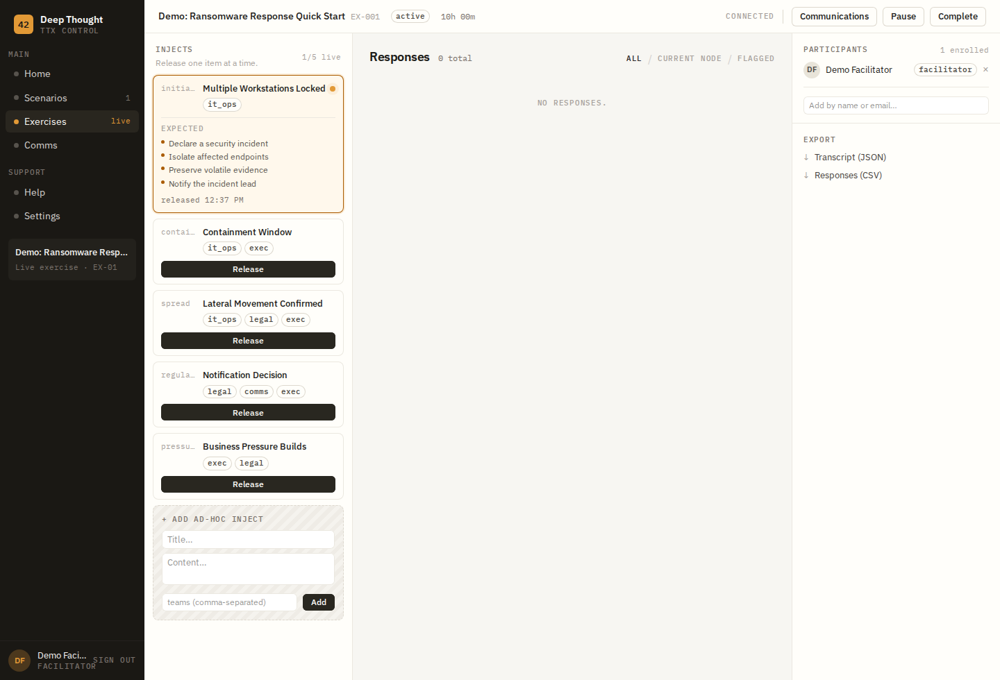
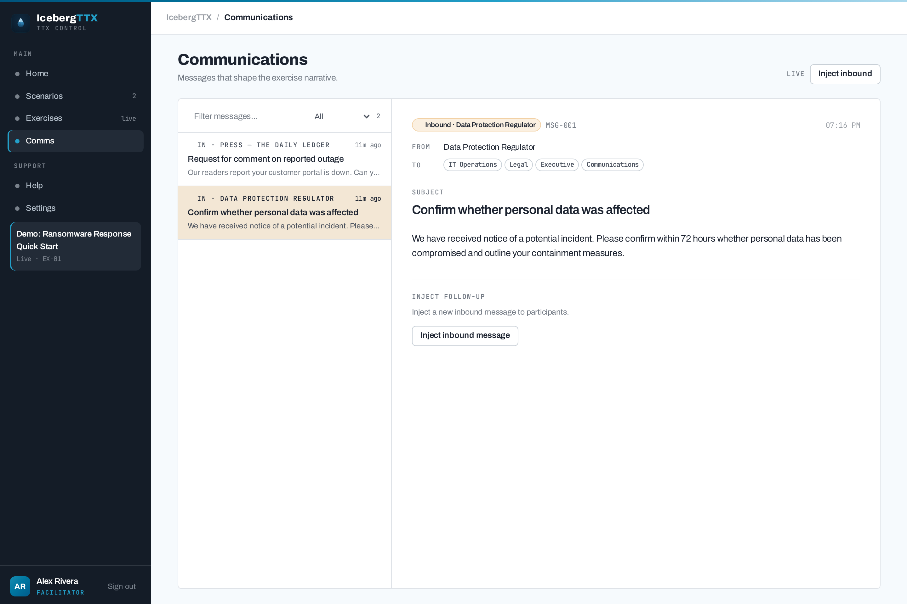
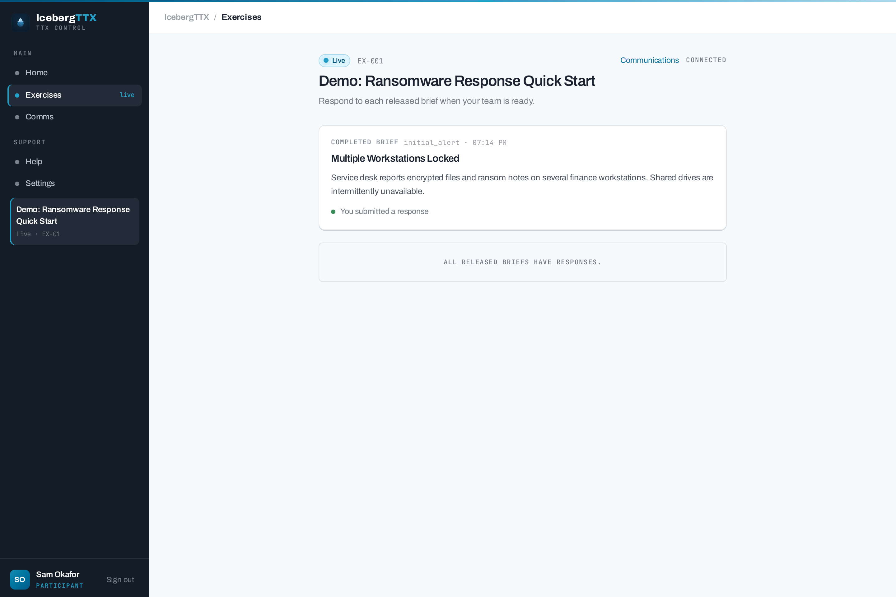
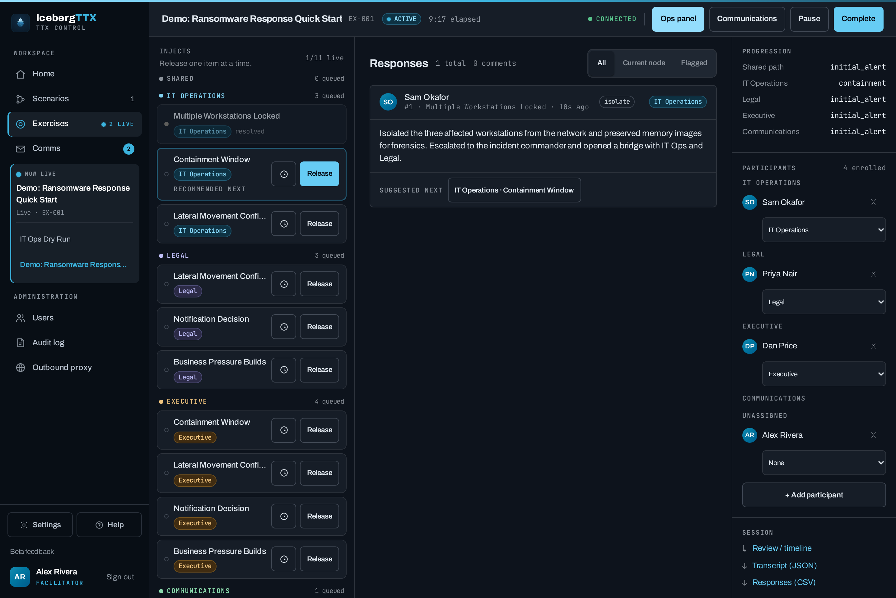

# IcebergTTX

[](https://github.com/IcebergAI/IcebergTTX/actions/workflows/ci.yml)


A tabletop exercise (TTX) platform for running cyber incident and business resilience scenarios.



## About

IcebergTTX helps teams rehearse their response to cyber incidents and other
disruptions through facilitated, scenario-driven tabletop exercises. A
**facilitator** builds or imports a branching scenario, then releases injects to
**participants** in real time; participants record decisions and free-text
responses that drive the scenario down different branches, while **observers**
follow along read-only. The platform simulates incident communications (regulators,
press, executives) and can use the Claude API to assess participant decisions and
suggest follow-up injects. It is API-first (FastAPI) with a server-rendered UI, and
ships with Docker Compose and Kubernetes deployment manifests.

## Features

- **Scenario library** — build branching inject trees (or linear chained flows) in the visual scenario builder, or import/export them as JSON
- **Live exercises** — facilitator releases injects in real time via WebSocket push
- **Participant responses** — free-text and multiple-choice, driving scenario branches
- **Team comment threads** — participants discuss released injects in group-scoped comment threads
- **Simulated communications** — two-pane inbox/outbox for regulatory, press, and executive comms
- **LLM assessment** — Claude evaluates participant decisions and suggests follow-up injects
- **Role-based access** — facilitator, participant, and observer roles (self-registration always creates a participant; elevation is out-of-band)
- **Role preview** — facilitators can view the app as a participant or observer without changing accounts
- **Security hardening** — enforced SECRET_KEY at startup, Secure cookie + CSRF origin checks, login rate limiting, and structured audit logging with off-host SIEM forwarding (syslog / HTTP / file)
- **Sample templates** — optional bundled scenarios can be loaded from Settings; the database stays empty by default
- **Export** — full exercise transcript (JSON) or responses table (CSV)

## Screenshots

The hero above is the **facilitator console** — a live exercise with a team-grouped inject tree, one-at-a-time release, and participant responses.

| Command center | Scenario inject tree |
|---|---|
|  |  |
| **Simulated communications** | **Participant view** |
|  |  |

The UI ships with a light/dark theme toggle (system-aware):



## Tech Stack

- **Backend**: Python 3.14+, FastAPI (fully async), SQLModel + async SQLAlchemy, PostgreSQL (asyncpg)
- **Frontend**: Jinja2 templates, Tailwind CSS v4 (CLI-compiled), Alpine.js
- **Real-time**: WebSockets (FastAPI native)
- **Auth**: JWT tokens (httpOnly cookie + localStorage)
- **LLM**: Anthropic Claude API (`anthropic>=0.40`, async with prompt caching)

## Setup

```bash
# Create and activate a virtual environment
python -m venv .venv
source .venv/bin/activate   # Windows: .venv\Scripts\activate

# Install dependencies
pip install -e ".[dev]"

# Configure environment
cp .env.example .env
# Edit .env:
#   SECRET_KEY        required — generate: python -c "import secrets; print(secrets.token_hex(32))"
#   DEV_MODE=true     for local HTTP development (relaxes the SECRET_KEY check and the Secure cookie flag)
#   ANTHROPIC_API_KEY optional — enables LLM features
# Outside DEV_MODE the app refuses to start if SECRET_KEY is unset, the default, or shorter than 32 chars.

# Run the development server
uvicorn app.main:app --reload
```

Open [http://localhost:8000](http://localhost:8000). Self-registration always creates a **participant**; privileged roles are assigned out-of-band. Create your first admin/facilitator with the bootstrap command:

```bash
# Creates a global-admin facilitator (prompts for the password if --password is omitted).
python -m app.bootstrap_admin --email you@example.com --name "You"
```

The command is idempotent — re-run it to promote or re-enable an existing account, add `--reset-password` to set a new password (revokes existing sessions), or `--no-admin` for a plain facilitator without the global-admin flag. In a container, prefix it with `docker compose exec app` or `kubectl exec -n iceberg-ttx deploy/iceberg-ttx-app --` (see the deployment sections below).

As a facilitator, create a scenario and exercise. To try the app quickly, open Settings and load a sample scenario or demo exercise. In-app help is available at [/help](http://localhost:8000/help).

## Docker Deployment

A `docker-compose.yml` is provided for single-host deployments. It runs the app, PostgreSQL 17, and **Caddy** as a reverse proxy with **automatic HTTPS**.

```bash
# Copy and fill in secrets (POSTGRES_PASSWORD and SECRET_KEY are required)
cp .env.example .env
# For a public deployment, set SITE_ADDRESS to your domain (see below).

# Build and start
docker compose up -d

# Check all three services are healthy
docker compose ps
```

Caddy serves the app over **HTTPS on port 443** (and redirects `:80`). It serves compiled static files directly and proxies everything else (including WebSocket upgrades at `/ws/`) to uvicorn. Set `SITE_ADDRESS` in `.env` to your public domain for an automatic Let's Encrypt certificate; the default `localhost` uses Caddy's **internal self-signed CA**, so `docker compose up` works over HTTPS immediately for local testing (your browser will warn on the untrusted cert — expected).

Create your first admin account once the stack is up:

```bash
docker compose exec app python -m app.bootstrap_admin --email you@example.com --name "You"
```

> **TLS**: Caddy terminates HTTPS itself. For a public deployment, point DNS at the host, set `SITE_ADDRESS=your.domain.com` in `.env`, and make sure ports 80 and 443 are reachable — Caddy provisions and renews a Let's Encrypt certificate automatically (certs persist in the `caddy_data` volume). Locally, the default `SITE_ADDRESS=localhost` issues an internal self-signed cert. The app sets `Secure` cookies, so always use HTTPS — only use `SITE_ADDRESS=:80` (plain HTTP) for throwaway testing behind your own TLS terminator.

To stop without losing data:
```bash
docker compose down        # keeps named volumes (postgres_data, uploads)
docker compose down -v     # also deletes volumes — permanent data loss
```

## Kubernetes Deployment

Manifests are in `k8s/`. Apply in order:

```bash
kubectl apply -f k8s/namespace.yaml
kubectl apply -f k8s/secrets.yaml -f k8s/configmap.yaml

# Before applying, replace placeholder values in k8s/secrets.yaml,
# replace 'your-registry/iceberg-ttx:latest' in:
#   k8s/app/deployment.yaml
#   k8s/caddy/deployment.yaml   (the copy-static initContainer uses the app image)
# (pin by digest — image@sha256:… — in production for reproducible rollouts;
#  Dependabot's docker updater keeps the base-image digests current), and set
# the hostname/issuer/ingressClassName placeholders in k8s/caddy/ingress.yaml.

kubectl apply -f k8s/postgres/
kubectl rollout status statefulset/postgres -n iceberg-ttx

kubectl apply -f k8s/app/
kubectl rollout status deployment/iceberg-ttx-app -n iceberg-ttx

kubectl apply -f k8s/caddy/          # Deployment + ClusterIP Service + TLS Ingress
kubectl rollout status deployment/caddy -n iceberg-ttx

# Confine east-west traffic (requires a NetworkPolicy-enforcing CNI):
kubectl apply -f k8s/networkpolicy.yaml

# Create the first admin account (idempotent):
kubectl exec -n iceberg-ttx deploy/iceberg-ttx-app -- \
    python -m app.bootstrap_admin --email you@example.com --name "You"
```

> **TLS**: in Kubernetes, Caddy runs as a plain-HTTP (`:8080`) internal reverse proxy — TLS is terminated by the cluster **Ingress** (unchanged). The `caddy` Service is `ClusterIP`; `k8s/caddy/ingress.yaml` terminates HTTPS (cert-manager annotation + `force-ssl-redirect`) and forwards to it. Fill in the hostname, `ingressClassName`, and issuer before applying. Do **not** switch the `caddy` Service to a `LoadBalancer` on `:80` — that serves auth over plaintext. (Caddy's automatic-HTTPS mode is used only in the Docker Compose deployment, where it is the edge.)
>
> **Origin checks**: browser WebSocket auth verifies the upgrade's `Origin` against the request `Host` (plus `TRUSTED_ORIGINS`). This works out of the box because every hop preserves `Host` — but if you configure the Ingress or proxy chain to rewrite it, set `TRUSTED_ORIGINS` in `k8s/configmap.yaml` to your public hostname so live updates keep working.
>
> **Pod hardening**: all three workloads run non-root under a PSS-`restricted`-style `securityContext` (no privilege escalation, all capabilities dropped, `RuntimeDefault` seccomp; app + init containers use a read-only root filesystem). The Postgres StatefulSet runs as uid 999 with `fsGroup: 999`, which needs a StorageClass that honours `fsGroup`.

> **Note**: The app must run as a single replica (`replicas: 1`) until the in-memory WebSocket manager is replaced with a distributed backend (e.g. Redis pub/sub). The manifests enforce this with `strategy: Recreate`.

## Backup & restore

All persistent state lives in two places: the **PostgreSQL database** (users,
scenarios, exercises, injects, responses, communications, audit events) and the
**`uploads/` volume** (inject file attachments). Back up both — a database dump
alone will reference attachment files that no longer exist. Take backups on a
regular schedule; without them a lost volume or PVC means losing the exercise
record.

Alembic self-migrates on startup, so a dump taken from an **older** app version
restores cleanly into a **newer** one — the schema is upgraded to head
automatically on the next boot. Restoring into an **older** app than the dump was
taken from is not supported.

> Postgres `pg_dump`/`pg_restore` are version-sensitive: run them from the same
> major version as the server (the images here are `postgres:17`). The examples
> use the custom format (`-Fc`), which is compressed and restorable with
> `pg_restore`.

### Docker Compose

```bash
# --- Database ---
# Dump the database (custom format) to a file on the host:
docker compose exec -T db \
    pg_dump -U iceberg_ttx -d iceberg_ttx -Fc \
    > "iceberg_ttx-$(date -u +%Y%m%dT%H%M%SZ).dump"

# Restore into a running, empty database (--clean drops existing objects first):
docker compose exec -T db \
    pg_restore -U iceberg_ttx -d iceberg_ttx --clean --if-exists \
    < iceberg_ttx-YYYYMMDDTHHMMSSZ.dump

# --- Uploads volume (inject attachments) ---
# Tar the uploads named volume to a file on the host:
docker run --rm \
    -v deep_thought_uploads:/data:ro -v "$PWD":/backup alpine \
    tar czf /backup/uploads-"$(date -u +%Y%m%dT%H%M%SZ)".tar.gz -C /data .

# Restore it (into the same named volume):
docker run --rm \
    -v deep_thought_uploads:/data -v "$PWD":/backup alpine \
    sh -c 'tar xzf /backup/uploads-YYYYMMDDTHHMMSSZ.tar.gz -C /data'
```

> The volume name is `<project>_uploads` — `deep_thought_uploads` when the compose
> project is the repo directory. Run `docker volume ls` to confirm the exact name.

### Kubernetes

```bash
# --- Database ---
# Dump from the postgres pod to a file on your workstation:
kubectl exec -n iceberg-ttx statefulset/postgres -- \
    pg_dump -U iceberg_ttx -d iceberg_ttx -Fc \
    > "iceberg_ttx-$(date -u +%Y%m%dT%H%M%SZ).dump"

# Restore (streams the local dump back into the pod):
kubectl exec -i -n iceberg-ttx statefulset/postgres -- \
    pg_restore -U iceberg_ttx -d iceberg_ttx --clean --if-exists \
    < iceberg_ttx-YYYYMMDDTHHMMSSZ.dump

# --- Uploads volume ---
# Copy the attachments out of the app pod:
kubectl cp -n iceberg-ttx \
    "$(kubectl get pod -n iceberg-ttx -l app.kubernetes.io/name=iceberg-ttx-app \
        -o jsonpath='{.items[0].metadata.name}')":/app/uploads ./uploads-backup
```

#### Scheduled database backups (optional)

`k8s/postgres/backup-cronjob.yaml` is a ready-to-adapt `CronJob` that runs a daily
`pg_dump` to a dedicated `postgres-backups` PVC with simple time-based retention:

```bash
kubectl apply -f k8s/postgres/backup-cronjob.yaml
```

It is a **starting point**, not a complete backup strategy — the dumps sit on an
in-cluster PVC (same failure domain as the database). For real durability, copy
them off-cluster (e.g. to object storage), back up the `uploads/` PVC too, and
**test your restores** regularly; a backup you have never restored is not a backup.

## Forward security events to your SIEM

Audit events (logins, authorization denials, privilege/role changes, inject
release/delete, exports, config changes, …) can be shipped off-host to a SIEM so
they are centralized, retained, and alertable even if a pod restarts or the app
is compromised (#24). **The app is the forwarder** — there is no Vector/Fluent Bit
sidecar to run.

- **Enable it live** at `/admin/audit` (admin only): toggle *Auditing enabled*,
  pick the methods, set the minimum severity, and click **Send test event** to
  verify connectivity end-to-end.
- **Methods** (any combination):
  - `stdout` — the always-on JSON baseline on the `iceberg_ttx.audit` logger; a
    node-level shipper (Filebeat/Fluentd/Vector) you provide can tail it.
  - `file` — append JSON lines to a path (for a file-tailing shipper).
  - `syslog` — RFC 5424 over UDP/TCP; point TCP at a TLS syslog collector for
    secure transit.
  - `http` — JSON `POST` to a Splunk HEC / Elastic / generic webhook endpoint,
    authenticated with a bearer token.
- **Secret handling**: the HTTP bearer token is set **only** via the
  `SIEM_HTTP_TOKEN` env var / Secret — it is never stored in the database, never
  returned by the API, and never logged.
- **Reliability**: a slow or unreachable SIEM (5-second timeouts) **never blocks
  or fails a request** — each sink is failure-isolated, and the persisted
  `AuditEvent` table (`AUDIT_PERSIST=true`) remains the durable record. Ensure
  hosts are NTP-synced to UTC so SIEM correlation is accurate.

Seed the defaults from the `SIEM_*` env vars (see `.env.example`); routing is then
edited live from `/admin/audit`. In Kubernetes the non-secret routing lives in
`k8s/configmap.yaml` and the token in `k8s/secrets.yaml`.

**Example alert rule** (brute-force detection, ties to the login rate limiter
#11) — Splunk SPL over the shipped events:

```spl
index=iceberg_ttx action="auth.login" result="fail"
| bin _time span=5m
| stats count by _time, source_ip
| where count >= 5
```

Alert when a single `source_ip` produces ≥ 5 failed `auth.login` events in a
5-minute window. Comparable rules are worth configuring for `authz.denied`
spikes, `audit.settings_updated` / role changes, and unexpected `*.export` events.
Treat the SIEM store as append-only with restricted read/write access, and set a
retention period that meets your legal/contractual requirements.

## Single sign-on (OIDC / SSO)

IcebergTTX can authenticate users against an external OpenID Connect identity
provider (IdP) instead of, or alongside, the built-in email/password store. The
flow is **Authorization Code + PKCE**: `GET /api/auth/oidc/{provider}/login`
redirects to the IdP; `GET /api/auth/oidc/{provider}/callback` validates the
response (`state`, `nonce`, and the ID token's signature/issuer/audience/expiry via
the IdP's JWKS) and then issues the normal app session cookie — so every existing
role/authorization check is unchanged.

- **`AUTH_MODE`** — `local` (password only), `oidc` (SSO only; local login/register
  are disabled), or `both` (default). Enabled providers each render a "Sign in
  with …" button on the login page; multiple providers can run concurrently.
- **Provisioning** — first-time SSO users are just-in-time created as
  **participant** (the IdP can never self-assign a privileged role). A returning
  identity is matched on its stable `sub`; a *verified* email that matches an
  existing local account links the two (preserving that account's role). A disabled
  account (`is_active=false`) is refused regardless of the IdP.
- **Role mapping (optional, off by default)** — set `OIDC_<PROVIDER>_ROLE_CLAIM`
  and `OIDC_<PROVIDER>_ROLE_MAP` (`group=role,…`) to elevate members of specific
  IdP groups. Unmapped users stay participants.
- **Secrets** — client secrets are read only from the environment
  (`OIDC_*_CLIENT_SECRET`); they are never stored in the database or logged. SSO
  login/link/JIT-provision events are audited (`auth.oidc_login`, `auth.oidc_link`,
  `auth.jit_provision`) without tokens or codes.

Set `OIDC_REDIRECT_BASE_URL` to the app's public `https://` origin (no trailing
slash) so the callback URL matches what you register with the IdP.

### Microsoft Entra ID

1. **Entra admin center → App registrations → New registration.** Add a **Web**
   redirect URI: `https://<your-host>/api/auth/oidc/entra/callback`.
2. **Certificates & secrets → New client secret**; copy the value.
3. Copy the **Application (client) ID** and **Directory (tenant) ID**. Use the
   specific tenant ID — never `common`/`organizations` — so issuer validation is
   exact.
4. (Optional roles) **App roles** → define roles, assign users/groups; they arrive
   in the `roles` claim. Set `OIDC_ENTRA_ROLE_CLAIM=roles` and map them.
5. Configure:
   ```bash
   AUTH_MODE=both
   OIDC_ENTRA_ENABLED=true
   OIDC_ENTRA_TENANT_ID=<tenant-guid>
   OIDC_ENTRA_CLIENT_ID=<client-id>
   OIDC_ENTRA_CLIENT_SECRET=<client-secret>
   # OIDC_ENTRA_ROLE_CLAIM=roles
   # OIDC_ENTRA_ROLE_MAP=ttx-facilitators=facilitator
   ```

### Authentik (self-hostable — a good test IdP)

1. **Providers → Create → OAuth2/OpenID Provider.** Client type **Confidential**;
   add redirect URI `https://<your-host>/api/auth/oidc/authentik/callback`. Copy the
   **Client ID** and **Client Secret**.
2. **Applications → Create**, choose a **slug**, and bind the provider. The
   discovery URL is `https://<authentik-host>/application/o/<slug>/.well-known/openid-configuration`.
3. (Optional roles) ensure the `groups` scope is on the provider; group names arrive
   in the `groups` claim.
4. Configure:
   ```bash
   AUTH_MODE=both
   OIDC_AUTHENTIK_ENABLED=true
   OIDC_AUTHENTIK_BASE_URL=https://<authentik-host>
   OIDC_AUTHENTIK_APP_SLUG=<slug>
   OIDC_AUTHENTIK_CLIENT_ID=<client-id>
   OIDC_AUTHENTIK_CLIENT_SECRET=<client-secret>
   # OIDC_AUTHENTIK_ROLE_MAP=ttx-facilitators=facilitator
   ```

### Auth0

1. **Auth0 Dashboard → Applications → Create Application → Regular Web
   Application.** Add `https://<your-host>/api/auth/oidc/auth0/callback` to
   **Allowed Callback URLs**. Copy the **Domain**, **Client ID**, and **Client
   Secret**.
2. (Optional roles) Auth0 does not send roles by default. Add an **Action**
   (Login flow) that sets a *namespaced* custom claim on the ID token, e.g.
   `api.idToken.setCustomClaim("https://ttx.example.com/roles", event.authorization?.roles)`,
   and point `OIDC_AUTH0_ROLE_CLAIM` at that exact URI.
3. Configure:
   ```bash
   AUTH_MODE=both
   OIDC_AUTH0_ENABLED=true
   OIDC_AUTH0_DOMAIN=your-tenant.us.auth0.com
   OIDC_AUTH0_CLIENT_ID=<client-id>
   OIDC_AUTH0_CLIENT_SECRET=<client-secret>
   # OIDC_AUTH0_ROLE_CLAIM=https://ttx.example.com/roles
   # OIDC_AUTH0_ROLE_MAP=ttx-facilitators=facilitator
   ```

### Okta

1. **Okta Admin → Applications → Create App Integration → OIDC / Web
   Application.** Add `https://<your-host>/api/auth/oidc/okta/callback` as the
   **Sign-in redirect URI**. Copy the **Client ID** and **Client Secret**, and
   your Okta **domain**.
2. Choose the authorization server: leave `OIDC_OKTA_AUTH_SERVER` blank to use the
   **org** server, or set it to `default` (or a custom authorization-server id).
   The discovery URL is
   `https://<domain>/oauth2/<server>/.well-known/openid-configuration` (org server
   omits `/oauth2/<server>`).
3. (Optional roles) add a **groups claim** to the token on the chosen
   authorization server so group names arrive in the `groups` claim.
4. Configure:
   ```bash
   AUTH_MODE=both
   OIDC_OKTA_ENABLED=true
   OIDC_OKTA_DOMAIN=dev-12345.okta.com
   OIDC_OKTA_AUTH_SERVER=default
   OIDC_OKTA_CLIENT_ID=<client-id>
   OIDC_OKTA_CLIENT_SECRET=<client-secret>
   # OIDC_OKTA_ROLE_MAP=ttx-facilitators=facilitator
   ```

## Running Tests

```bash
pytest
pytest tests/ --ignore=tests/test_ui.py   # skip live Playwright tests
```

## Rebuilding CSS

The shared Iceberg design system (cool-grey oklch tokens, cyan accent, and the
`.rail`/`.workspace` component vocabulary) lives in `static/css/iceberg.css`,
which `input.css` imports alongside Tailwind. After editing templates or the
design system, rebuild the Tailwind output:

```bash
tailwindcss -i static/css/input.css -o static/css/output.css
```

## Project Structure

```
app/
├── main.py          # App factory + lifespan (settings validation, middleware)
├── config.py        # Settings (pydantic-settings, reads .env) + startup validation
├── middleware.py    # Audit request context + CSRF origin checks
├── database.py      # Async Postgres engine + get_session dependency
├── dependencies.py  # FastAPI dependencies (auth, role guards)
├── models/          # SQLModel table definitions (incl. AuditEvent, AuditSettings)
├── schemas/         # Pydantic request/response schemas
├── routers/         # FastAPI routers (one per resource, incl. audit) + ui.py (Jinja2 pages)
├── services/        # Business logic (auth, scenario, exercise, inject, inject_comment, response, comms, llm, ws_manager, access_control, audit_service, siem_service, audit_settings_service, rate_limit)
├── samples/         # Bundled quick-start scenario templates (loaded only on demand)
└── templates/       # Jinja2 HTML templates
    ├── base.html            # App shell (dark rail + breadcrumb topbar), shared JS helpers
    ├── dashboard.html       # Command center
    ├── help.html            # In-app help & documentation
    ├── settings.html        # Profile, theme, role preview, and sample loader
    ├── auth/                # login.html, register.html
    ├── scenarios/           # list, detail, editor
    ├── exercises/           # list, facilitator console, participant view
    └── communications/      # inbox
tests/               # Pytest test suite (conftest.py + one file per resource)
static/css/          # input.css + iceberg.css (shared design system) → output.css (Tailwind CLI compiled)
static/fonts/        # Self-hosted Archivo · JetBrains Mono · Spectral (woff2) + fonts.css
static/img/          # Iceberg brand marks (SVG)
docs/                # README screenshots
Dockerfile           # Multi-stage build (Tailwind compile + Python runtime)
docker-compose.yml   # app + postgres:17 + caddy (auto-HTTPS, non-root)
docker/Caddyfile     # Caddy reverse proxy (automatic HTTPS) + static serving
k8s/                 # Kubernetes manifests (namespace, secrets, postgres, app, caddy)
```

## Quick Workflow

1. **Create a scenario** — Scenarios → New, or import a JSON file
2. **Create an exercise** — Exercises → New, select a scenario, optionally enable LLM
3. **Enrol participants** — Facilitator console → Participants panel, search and add users
4. **Start and release injects** — Hit Start, then Release each inject when ready
5. **Review responses** — Middle pane; choose which branch to release next
6. **Complete and export** — Complete button, then export transcript/responses from the right pane

See [/help](/help) for full documentation including the scenario JSON schema.

## Contributing

Contributions are welcome! See [CONTRIBUTING.md](CONTRIBUTING.md) for the
development workflow and PR expectations, and [CODE_OF_CONDUCT.md](CODE_OF_CONDUCT.md)
for community standards. Security issues should be reported privately per
[SECURITY.md](SECURITY.md).

## License

Licensed under the Apache License, Version 2.0. See [LICENSE](LICENSE) for the full
text. Copyright 2026 IcebergAI.
