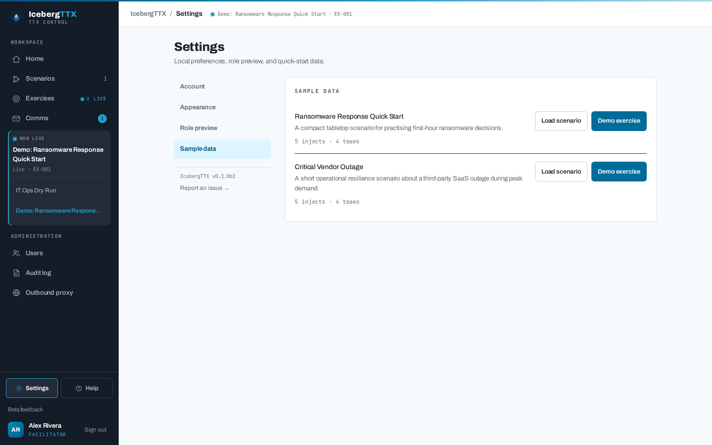
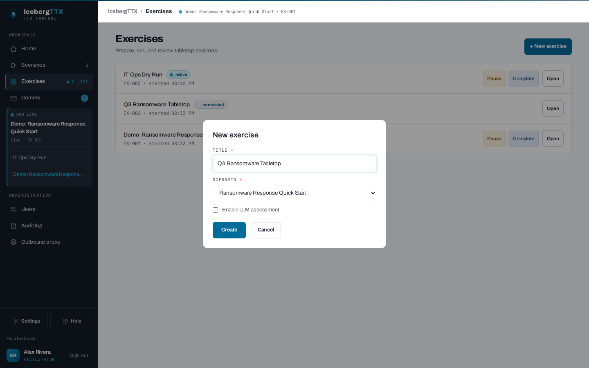
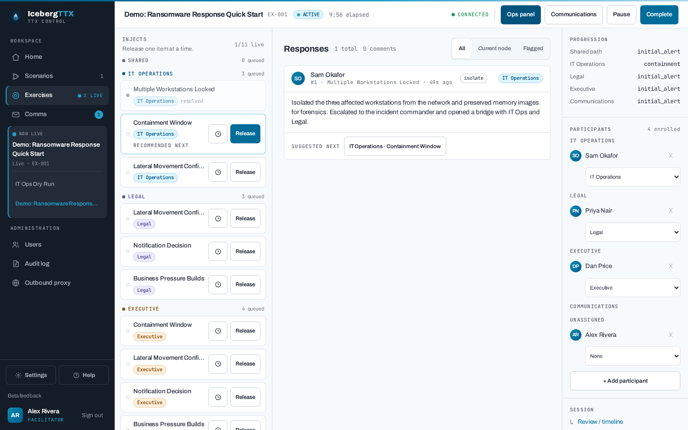
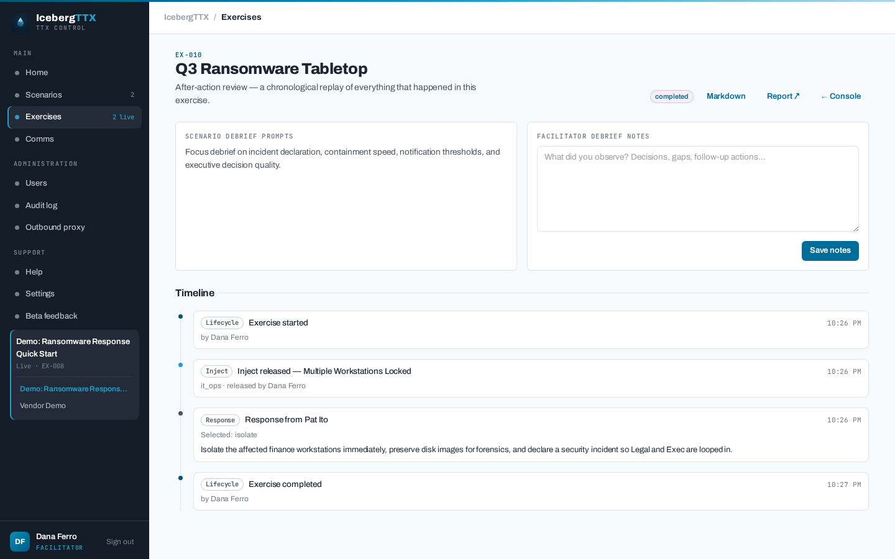
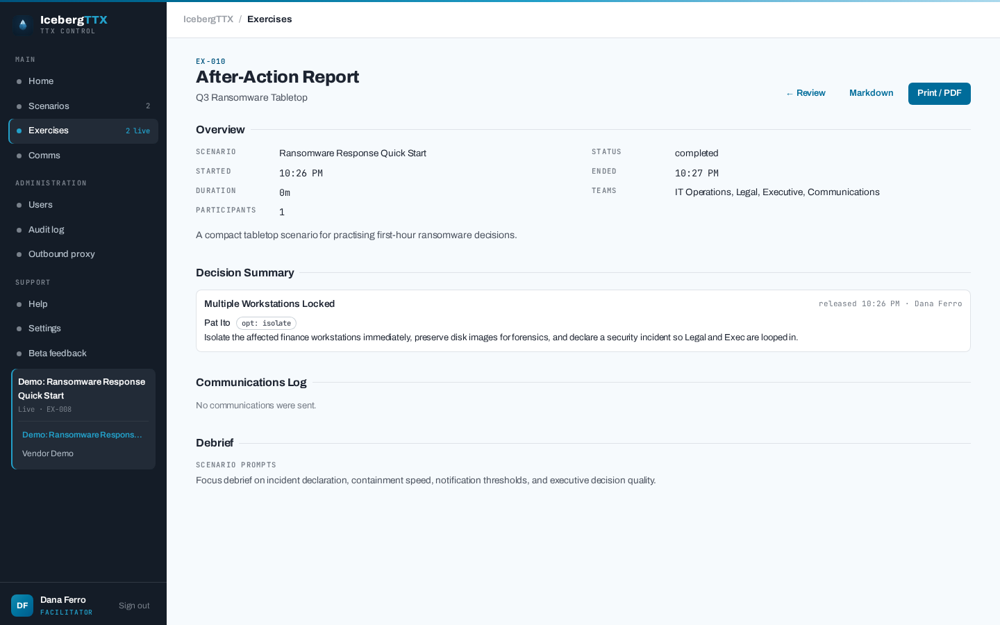

Running an exercise

# Facilitator guide

This is the end-to-end walk a facilitator takes to run a tabletop exercise —
**prepare** a scenario, **run** the live session, and **learn** from the after-action
review. It follows the bundled **Ransomware Response Quick Start** sample the whole way,
so you can reproduce every step.

!!! tip "Fastest possible start"
    From **Settings**, the sample loader has a **one-click demo** that seeds an exercise,
    starts it, and releases the first inject — handy for a quick look. This guide walks
    the manual path so you understand each control.

## Prepare

### 1. Load or build a scenario

You need a scenario before you can run anything. Either **build one** in the visual
[scenario builder](scenarios.md) (or **Import JSON**), or **load a bundled sample**.

Open **Settings** and load the **Ransomware Response Quick Start** sample — a 45-minute,
four-team scenario (IT Operations, Legal, Executive, Communications) with branching
decisions and a triggered press enquiry.

{ .shot }

The [scenario cookbook](cookbook.md) has paste-ready recipes if you want to author your
own patterns — linear drills, branching decisions, team targeting, and triggered comms.

### 2. Create an exercise

A **scenario** is the reusable script; an **exercise** is one run of it. From
**Exercises → New exercise**, give it a title, pick your scenario, and optionally enable
**AI assistance** (decision-quality assessment and suggested follow-up injects — needs an
AI provider configured on the server).

{ .shot }

On creation, every inject is **pre-seeded as pending** — targeted injects once per team,
shared injects once. Nothing is released yet: you decide what reaches the room and when
(see [step 5](#5-release-injects)).

### 3. Enrol participants and teams

Open the exercise's **facilitator console** and use the **Participants** panel to enrol
registered users. Each member is assigned a **team** (group) — for the ransomware sample,
map people onto `it_ops`, `legal`, `exec`, and `comms`. A member's team defaults from
their profile `team` when it matches one of the scenario's teams; you can change it any
time.

Participants join at `/exercises/{id}/participate`; observers get the same view read-only.

## Run

### 4. Start the exercise

Press **Start**. The exercise moves `draft → active` and its start time is recorded.
The lifecycle is a simple state machine — **Pause** halts new submissions
(`active → paused`), **Resume** returns to `active`, and **Complete** ends it
(`→ completed`, terminal).

### 5. Release injects

The facilitator console is a three-pane console: the **inject tree** on the left, the
**response feed** in the middle, and **participants / AI suggestions** on the right.

{ .shot }

**Injects are manual by default.** You press **Release** when the room is ready, and
participants on the targeted teams receive the inject instantly over WebSocket. Release is
only allowed while the exercise is `active`, and only for a `pending` inject. The
Ransomware Response sample is entirely manual, so this guide's walk-through never waits on
a clock.

**Injects can also be scheduled.** An inject with a `release_at_minutes` value auto-releases
that many minutes after the exercise starts, and the console shows a live **countdown** on
it. The clock is *pause-aware*: pausing the exercise defers the timer, and resuming re-arms
it with the remaining offset — a 20-minute inject in an exercise paused for 5 minutes fires
25 minutes after the start, not 20.

Scheduling never takes the room away from you. A scheduled inject can still be **released
early**, and its schedule can be **cancelled** outright, from the same control:

- **Set or change** a schedule on any pending inject — the clock icon in the inject tree.
- **Release early** — the ordinary **Release** button, which cancels the pending timer.
- **Cancel the schedule** — reverts the inject to manual-only release.

!!! warning "A timer only fires on an inject the team has actually reached"
    A schedule does not exempt an inject from the progression cursor. If the team has not yet
    reached that inject when its countdown expires — because they haven't responded to the
    inject before it — the release is **skipped**, and the timer does **not** re-arm when
    they catch up. The inject simply stays `pending` for you to release by hand.

    Leave slack in your offsets, and treat a schedule as a convenience that saves you
    watching a stopwatch rather than a guarantee the inject will appear. See the
    [scheduled-release recipe](cookbook.md#recipe-scheduled-release-put-an-inject-on-a-clock).

#### Who chooses the branch

Two different decisions, and they belong to two different people:

- **The team chooses the path.** The option they select advances their **progression
  cursor** to exactly one next node. That is the whole point — their decisions have to carry
  consequences.
- **You choose the pace.** You review the response and release that inject when the room is
  ready — now, later, or not at all.

What you **cannot** do is overrule the choice. The response card surfaces the team's
resolved next step as a **Suggested next** button; releasing the branch they did *not* pick
is rejected with `409 Inject is not the current branch for its group`.

So the scenario never picks a branch on its own — the route through the tree is theirs, and
the pace is yours. The one thing that *can* reach participants without you is a **scheduled
inject** (above): its countdown fires by itself, but only on a node the team's cursor has
already reached. A timer never chooses a branch, and never jumps ahead of the room.

{ .shot }

!!! note "One response settles the branch for the whole team"
    The cursor is per team, not per person. The first response commits the team to that
    branch, and the alternatives can no longer be released to them.

### 6. Monitor responses and AI assessment

Each response card shows the participant's stance and free-text reasoning alongside the
inject's **expected actions** — the evaluator cues authored into the scenario. With AI
assistance enabled, the model adds a **decision-quality** rating (good / adequate / poor)
and a short assessment, and can propose an **ad-hoc follow-up inject** you approve or
dismiss from the right pane. The **Flagged** filter surfaces responses the AI rated poor.

### 7. Simulate communications

The **Communications** inbox is a two-pane inbox/outbox for regulator, press, and
executive messages. Click **Inject inbound** to send a message from an external entity to
specific teams during the exercise.

{ .shot }

Scenarios can also **trigger** comms automatically: releasing an inject with a
`triggers_communications` entry drops the message into the inbox after its configured
delay. In the ransomware sample, releasing the **Notification Decision** inject brings a
press "Request for comment" a couple of seconds later. See the
[triggered-comms recipe](cookbook.md#recipe-triggered-communications-delayed-pressregulator-comms).

### 8. Complete the exercise

When the scenario has played out, press **Complete**. This records the end time and
unlocks the after-action review.

## Learn: review, report, and export

Completing an exercise opens up three after-action outputs.

### Review and replay

The **Review** page (`/exercises/{id}/review`) reconstructs the exercise as a single
chronological **timeline** — inject releases, responses (with decision-quality),
communications, comments, and state changes, merged in order. Beside it, the scenario
author's `debrief_notes` show read-only next to an **editable facilitator-notes** box for
your own observations.

{ .shot }

### Generated report

The **Report** page (`/exercises/{id}/report`) assembles a shareable after-action report:

- **Overview** — scenario, state, start/end, duration, teams, participant count
- **Executive summary** — optional, AI-drafted (needs an AI provider and AI assistance
  enabled on the exercise) and facilitator-editable
- **Decision summary** — released injects in order, with responses and assessments
- **Communications log** and the **debrief** (scenario prompts + your notes)

Use **Print / PDF** to hand it out, or download the Markdown via **`/report.md`**.

{ .shot }

### Export the raw record

For analysis or archival, export the full transcript as **JSON** (`/export` — injects,
responses, comments, members) or the responses table as **CSV** (`/export.csv`). All
after-action outputs are owner-only and audit-logged.

---

Next: the [scenario cookbook](cookbook.md) for authoring patterns, or
[scenario authoring](scenarios.md) for the full JSON schema.
