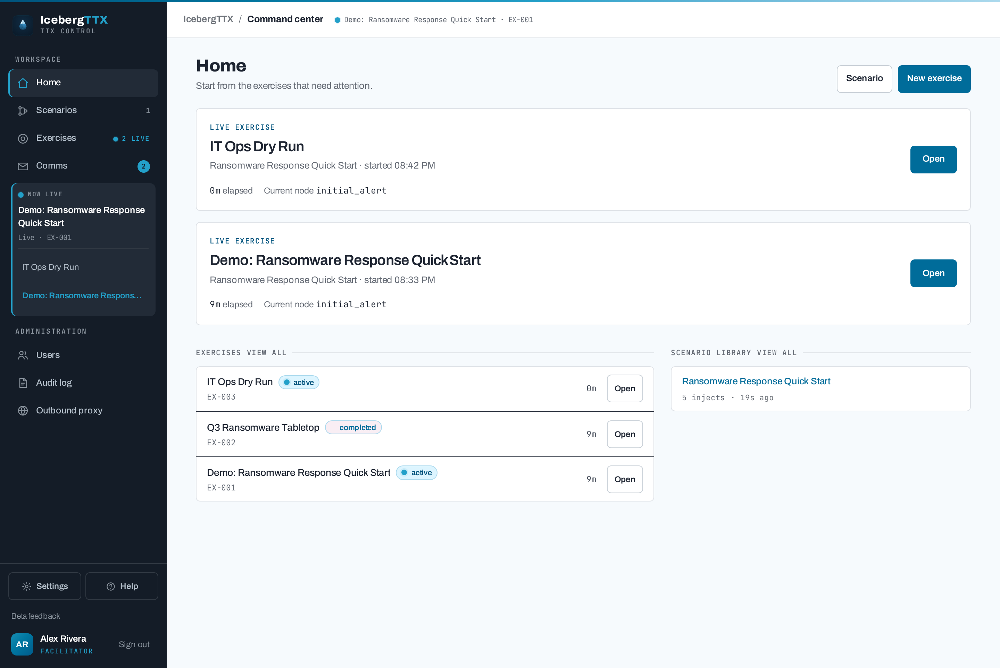
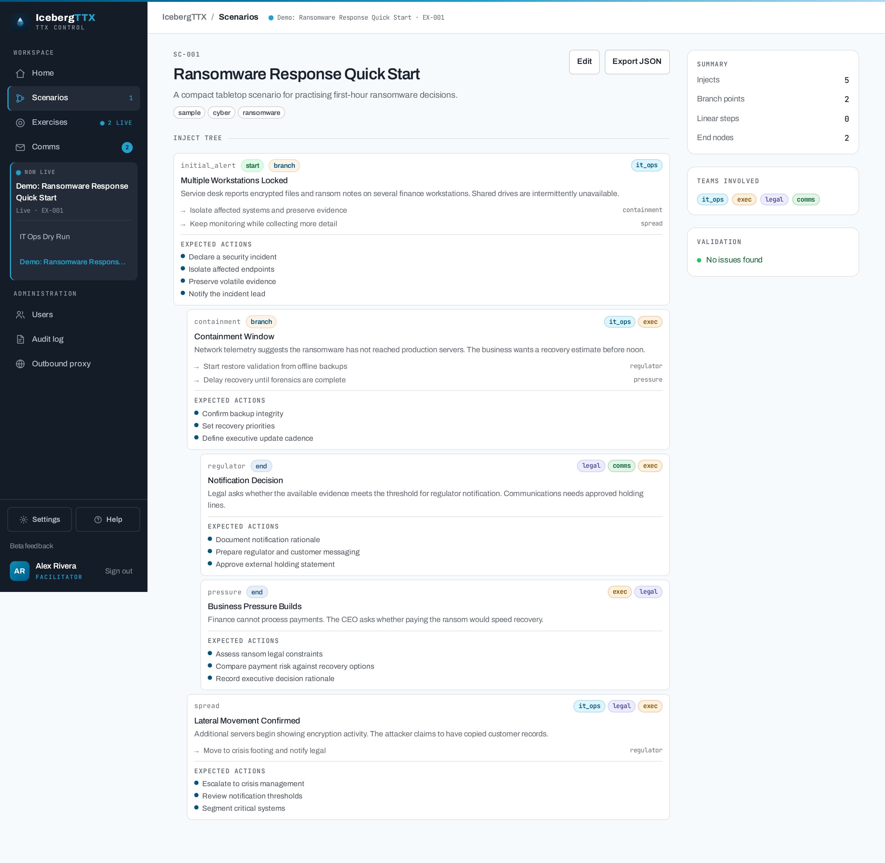

Tabletop exercise platform

Rehearse your response before the incident is real.

IcebergTTX runs facilitated, scenario-driven tabletop exercises for cyber
incidents and business-resilience events — branching injects, live participant
responses, simulated regulator and press comms, and optional AI-assisted
assessment.

[Deploy it](deployment.md){ .md-button .md-button--primary }
[Author a scenario](scenarios.md){ .md-button }
[View on GitHub](https://github.com/IcebergAI/IcebergTTX){ .md-button }

## Why IcebergTTX

A **facilitator** builds or imports a branching scenario, then releases injects to
**participants** in real time over WebSocket. Participants record decisions and
free-text reasoning that drive the scenario down different branches, while
**observers** follow along read-only. The platform simulates incident
communications (regulators, press, executives) and can use a pluggable AI provider
(Anthropic, Amazon Bedrock, OpenAI, Ollama, or Gemini) to assess decisions and
suggest follow-up injects. It is API-first (FastAPI) with a server-rendered UI, and
ships with Docker Compose and Kubernetes manifests.

-   :material-sitemap: __Branching scenarios__

    ---

    Build branching inject trees or linear chained flows in the visual scenario
    builder, or import them as JSON. Every branch reference is validated live
    before you run.

    [:octicons-arrow-right-24: Scenario authoring](scenarios.md)

-   :material-broadcast: __Live exercises__

    ---

    The facilitator releases injects one at a time; participants receive them
    instantly via WebSocket and submit a stance plus free-text reasoning.

-   :material-forum: __Team comment threads__

    ---

    Participants discuss released injects in group-scoped comment threads, visible
    only to their own team.

-   :material-email-alert: __Simulated communications__

    ---

    A two-pane inbox/outbox for regulatory, press, and executive comms — seed
    inbound messages or let the scenario trigger them on a delay.

-   :material-robot: __AI assessment__

    ---

    With an AI provider configured (`LLM_PROVIDER` — Anthropic, Bedrock, OpenAI,
    Ollama, or Gemini), the model rates each decision and suggests a follow-up
    inject the facilitator can approve and queue.

-   :material-shield-lock: __Security-hardened__

    ---

    Enforced `SECRET_KEY`, Secure cookies + CSRF origin checks, login rate
    limiting, strict CSP, and audit logging with off-host SIEM forwarding.

    [:octicons-arrow-right-24: Security posture](security.md)

## See it

The **facilitator console** — a live exercise with a team-grouped inject tree,
one-at-a-time release, and the participant response feed.

{ .shot }

{ .shot }

{ .shot }

{ .shot }

{ .shot }

## Roles

| Role | What they do |
|------|--------------|
| **Facilitator** | Creates/imports scenarios, starts exercises, enrols participants, controls the inject feed and branch selection, injects inbound comms, exports transcripts. |
| **Participant** | Receives injects for their team, posts team comments, submits a stance + free-text reasoning. Sees only what is assigned to their team. |
| **Observer** | Read-only. Sees all injects but cannot respond — for senior stakeholders, auditors, or evaluators. |

Self-registration always creates a **participant**; the facilitator role and admin
flag are assigned out-of-band (seeded or admin-managed).

## Next steps

-   :material-rocket-launch: __[Deploy](deployment.md)__ — Docker Compose or Kubernetes, behind Caddy with automatic HTTPS.

-   :material-file-tree: __[Author scenarios](scenarios.md)__ — the JSON schema, branching, linear flows, and triggered comms.

-   :material-shield-check: __[Security](security.md)__ — the hardening posture and how to report a vulnerability.

